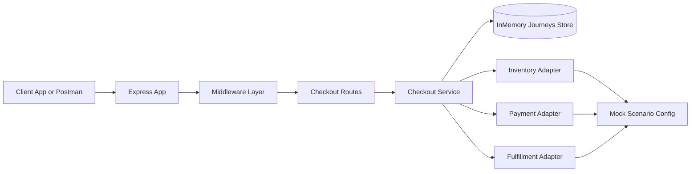
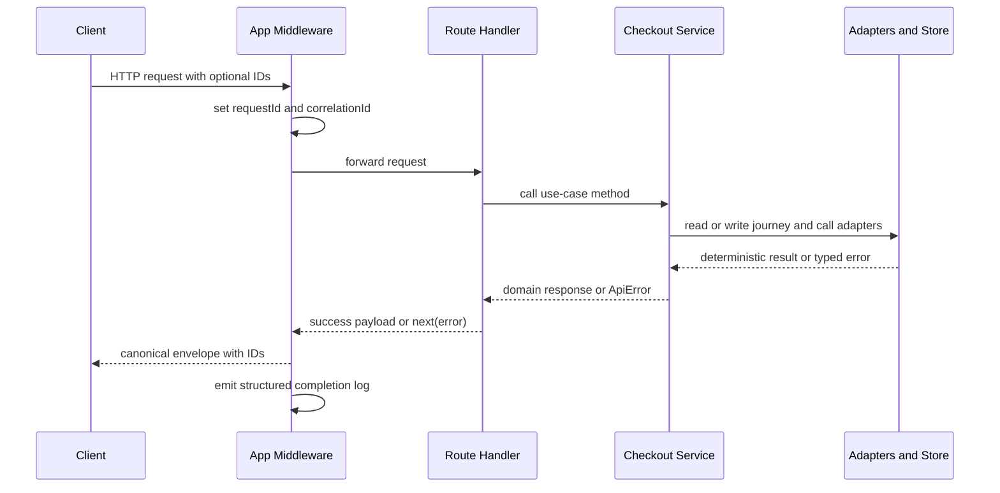
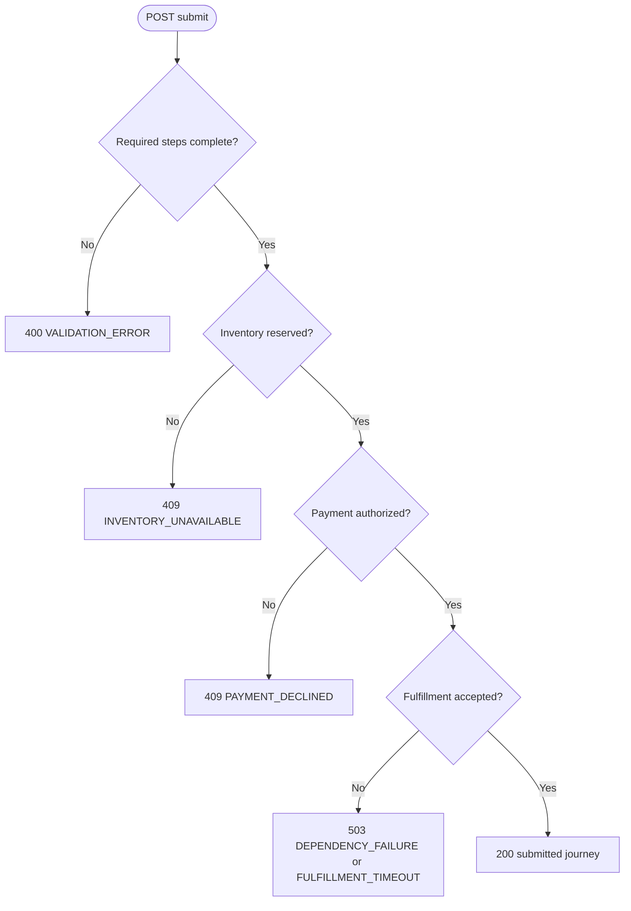

# Architecture

This service follows a contract-first Express + TypeScript structure with mocked downstream dependencies.

## System Architecture Diagram

## High-level components

- src/index.ts
  - process bootstrap and HTTP listen
- src/app.ts
  - middleware wiring and route registration
- src/routes/checkout.ts
  - HTTP handlers and envelope responses
- src/services/checkout.service.ts
  - journey lifecycle orchestration and submit flow
- src/data/journeys.store.ts
  - in-memory persistence abstraction
- src/adapters/*.adapter.ts
  - deterministic mock integrations for inventory, payment, fulfillment
- src/middleware/*.ts
  - correlation/request IDs, structured logging, centralized errors

## Request lifecycle

1. Request enters app middleware.
2. Correlation/request IDs are established and propagated.
3. Route handler calls checkout service.
4. Service uses in-memory store and mock adapters.
5. Response envelope includes data plus requestId/correlationId/timestamp.
6. Request logger emits one structured completion log per request.

## Request Sequence Diagram

## Submit orchestration path

On POST /v1/checkout/journeys/{journeyId}/submit:

1. Validate required steps are complete.
2. Reserve inventory.
3. Authorize payment.
4. Create fulfillment shipment.
5. Return submitted journey with submittedOrderId.

Deterministic failures are surfaced as canonical API errors.

## Submit Decision Diagram

## Design constraints

- No real downstream calls in MVP.
- No random failures in test flows.
- In-memory store is used by default.
