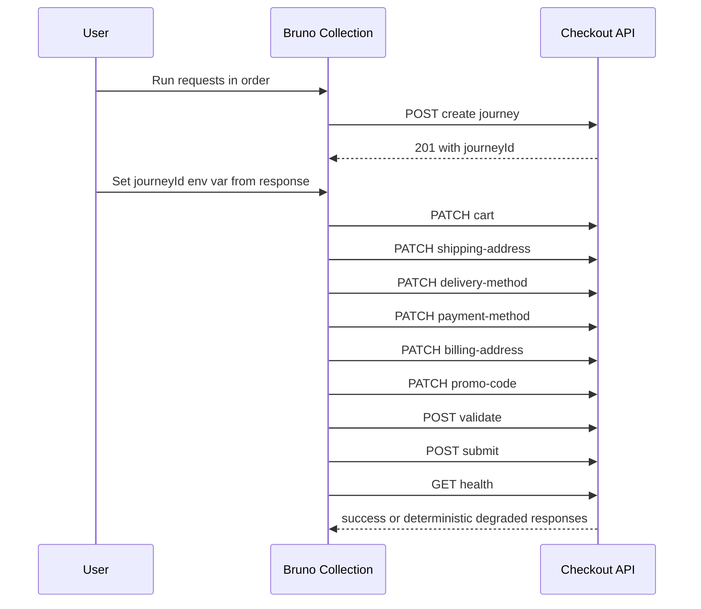

# Bruno Setup and Scenario Testing Guide

This guide shows how to use the Bruno collection in this repository to run all major API scenarios for the checkout journey service.

## Bruno Assets

- Collection metadata: [bruno/Customer-Experience-API/bruno.json](../bruno/Customer-Experience-API/bruno.json)
- Environment: [bruno/Customer-Experience-API/environments/local.bru](../bruno/Customer-Experience-API/environments/local.bru)
- Requests: [bruno/Customer-Experience-API/requests](../bruno/Customer-Experience-API/requests)

Open the [bruno/Customer-Experience-API](../bruno/Customer-Experience-API) folder in Bruno.

## Collection Sequence Diagram



## Prerequisites

- API running locally at http://localhost:3000
- Bruno app installed

## 1) Environment Variables

The provided environment file includes:

- baseUrl = http://localhost:3000
- journeyId = (leave blank initially)
- customerId = cust-1001
- requestId = req-initial
- correlationId = corr-initial

Optional scenario variables for manual tracking:

- inventoryScenario = success
- paymentScenario = success
- fulfillmentScenario = success

## 2) Collection Structure

The Bruno request tree includes three runnable folders:

1. 01-Happy-Path-Full-Flow
2. 02-Error-Scenarios
3. 03-Rule-Config-and-Validation-Scenarios

Within those folders, requests are organized in this flow order:

1. POST {{baseUrl}}/v1/checkout/journeys
2. PATCH {{baseUrl}}/v1/checkout/journeys/{{journeyId}}/steps/cart
3. PATCH {{baseUrl}}/v1/checkout/journeys/{{journeyId}}/steps/shipping-address
4. PATCH {{baseUrl}}/v1/checkout/journeys/{{journeyId}}/steps/delivery-method
5. PATCH {{baseUrl}}/v1/checkout/journeys/{{journeyId}}/steps/payment-method
6. PATCH {{baseUrl}}/v1/checkout/journeys/{{journeyId}}/steps/billing-address
7. PATCH {{baseUrl}}/v1/checkout/journeys/{{journeyId}}/steps/promo-code
8. POST {{baseUrl}}/v1/checkout/journeys/{{journeyId}}/validate
9. POST {{baseUrl}}/v1/checkout/journeys/{{journeyId}}/submit
10. GET {{baseUrl}}/health

For every request, keep headers:

- Content-Type: application/json
- x-request-id: {{requestId}}
- x-correlation-id: {{correlationId}}

## 3) No-Script Workflow Notes

This Bruno collection intentionally has no pre-request or test scripts.

- After each create journey request, copy response data.id into environment variable journeyId before running patch/validate/submit requests.
- Update requestId and correlationId manually when needed.
- Verify status code and payload fields directly in Bruno response panels.

## 4) Request payloads

### Create journey

```json
{
  "customerId": "{{customerId}}",
  "currency": "USD",
  "locale": "en-US"
}
```

### cart

```json
{
  "payload": {
    "items": [
      { "sku": "SKU-100", "name": "Demo Item", "quantity": 1, "unitPrice": 129.99 }
    ],
    "totalAmount": 129.99
  }
}
```

### shipping-address

```json
{
  "payload": {
    "firstName": "Sam",
    "lastName": "Taylor",
    "line1": "101 Main St",
    "city": "Austin",
    "state": "TX",
    "postalCode": "78701",
    "country": "US"
  }
}
```

### delivery-method

```json
{
  "payload": {
    "method": "standard"
  }
}
```

### payment-method

```json
{
  "payload": {
    "method": "card",
    "cardLast4": "4242"
  }
}
```

### billing-address

```json
{
  "payload": {
    "line1": "101 Main St",
    "city": "Austin",
    "state": "TX",
    "postalCode": "78701",
    "country": "US"
  }
}
```

### promo-code

```json
{
  "payload": {
    "code": "WELCOME10"
  }
}
```

### validate

No body required.

### submit

No body required.

## 5) Scenario matrix

Set API environment variables before starting the server, then run the matching Bruno requests.

### Happy path submit

Server config:

- MOCK_INVENTORY_SCENARIO=success
- MOCK_PAYMENT_SCENARIO=success
- MOCK_FULFILLMENT_SCENARIO=success

Expected submit:

- HTTP 200
- data.status is submitted
- data.submittedOrderId exists

Run folder: 01-Happy-Path-Full-Flow

### Payment declined

Server config:

- MOCK_PAYMENT_SCENARIO=declined

Expected submit:

- HTTP 409
- code is PAYMENT_DECLINED

Run folder: 02-Error-Scenarios
Run requests:

1. Prepare-Ready-Journey requests
2. Submit-Payment-Declined

### Inventory unavailable

Server config:

- MOCK_INVENTORY_SCENARIO=out_of_stock

Expected submit:

- HTTP 409
- code is INVENTORY_UNAVAILABLE

Run folder: 02-Error-Scenarios
Run requests:

1. Prepare-Ready-Journey requests
2. Submit-Inventory-Unavailable

### Fulfillment timeout

Server config:

- MOCK_FULFILLMENT_SCENARIO=timeout

Expected submit:

- HTTP 503
- code is FULFILLMENT_TIMEOUT

Run folder: 02-Error-Scenarios
Run requests:

1. Prepare-Ready-Journey requests
2. Submit-Fulfillment-Timeout

## 6) Validation and step-conflict checks

### Validation-style bad payload example

Use invalid shipping-address payload:

```json
{
  "payload": {
    "firstName": "Sam",
    "lastName": "Taylor",
    "line1": "101 Main St",
    "city": "Austin",
    "state": "TX",
    "postalCode": "ABC",
    "country": "US"
  }
}
```

Expected:

- HTTP 400
- code is VALIDATION_ERROR
- details include the field path and rule identifier

In requests: Rule-style-Invalid-Postal

### Eligibility rule check

Set shipping-address state to NY, then use this payment-method payload:

```json
{
  "payload": {
    "method": "cash_on_delivery"
  }
}
```

Expected:

- HTTP 409
- code is CUSTOMER_NOT_ELIGIBLE
- details include the eligibility rule identifier

In requests: Rule-style-NY-Cash-On-Delivery

### Warning-only validate example

Use a PO Box shipping line and overnight delivery.

Expected validate response:

- HTTP 200
- data.valid is true
- data.issues includes a warning with ruleId DYN-WARN-POBOX-EXPRESS

### Step dependency conflict

Try review-submit before required steps:

```json
{
  "payload": {
    "confirmed": true
  }
}
```

Expected:

- HTTP 409
- code is STEP_CONFLICT

In requests: Step-Conflict-Review-Submit-Too-Early

## 7) Health endpoint checks

Call GET {{baseUrl}}/health.

Expected:

- status is ok when all scenarios are success
- status is degraded when any scenario is non-success
- requestId and correlationId exist
