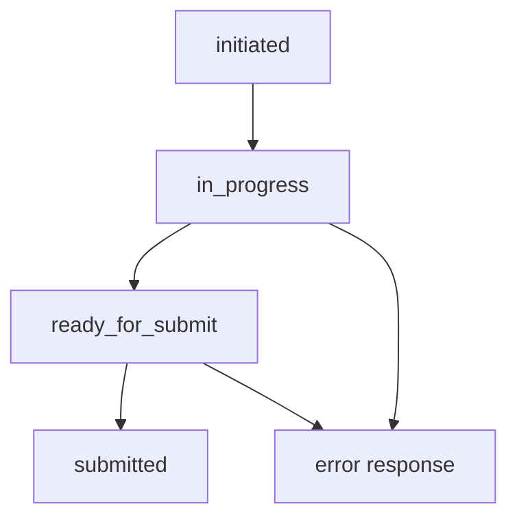
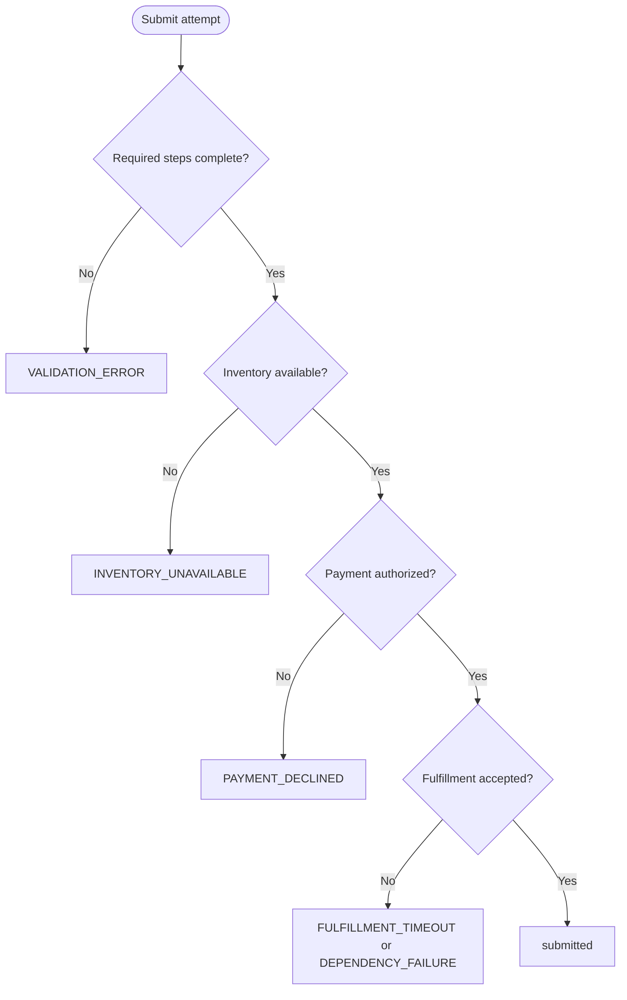

# Customer Journey Requirements

This document explains what the checkout customer journey means in product terms, what requirements govern it, and how those requirements map to API behavior.

## Purpose

The checkout journey API allows frontend clients to create, progress, validate, and submit a single checkout session using deterministic mocked dependencies.

Primary goals:

- Enable a clear, step-by-step checkout experience for customers.
- Provide deterministic success and failure behavior for development, QA, and demos.
- Preserve traceability through requestId and correlationId in all responses.

## Actors

- Customer: enters checkout data and submits an order.
- Frontend application: orchestrates calls to journey endpoints.
- Support and QA teams: diagnose outcomes through stable error codes and deterministic scenarios.

## Journey meaning by step

- cart: confirms selected items and total amount context.
- shipping-address: captures destination details required for delivery.
- delivery-method: captures fulfillment preference.
- payment-method: captures payment preference and authorization path.
- billing-address: captures billing context for payment processing.
- promo-code: optional discount or campaign context.
- review-submit: explicit user confirmation before submit.

## Functional requirements

### Journey lifecycle requirements

- The API must create a new journey and return an initialized state.
- The API must allow step-by-step updates using stepId-based PATCH calls.
- The API must enforce prerequisite step progression where defined.
- The API must provide pre-submit validation and return issues when requirements are incomplete.
- The API must submit only when required steps are complete.

### Response and error requirements

- Successful responses must include: data, requestId, correlationId, timestamp.
- Error responses must include: code, message, requestId, correlationId, timestamp, and optional details.
- Stable domain error codes must be used for deterministic client handling.

### Deterministic downstream behavior requirements

- Submit flow must use mocked adapters only.
- Adapter behavior must be controlled by explicit environment scenario flags.
- No random failure logic is allowed in MVP behavior.

## Non-functional requirements

- Traceability: all responses include requestId and correlationId.
- Debuggability: structured request completion logs include IDs and latency.
- Determinism: scenario-driven behavior is reproducible across local and CI.
- Maintainability: orchestration and mapping logic remain centralized and test-covered.

## In-scope and out-of-scope

### In scope

- Single journey resource with step updates.
- Mocked inventory/payment/fulfillment outcomes.
- Health status reflecting scenario state.
- Deterministic happy and degraded paths.

### Out of scope (current MVP)

- Real downstream service integration.
- Persistent database storage.
- Authentication and authorization.
- Finalized dynamic rules engine runtime enforcement.

## State transition expectations

Journey statuses are expected to move through:

- initiated
- in_progress
- ready_for_submit
- submitted

Failure outcomes are represented by API error responses and stable error codes in submit/step operations.

## Submit decision expectations

## Rules and scenario expectations

Rules-oriented checks are expected to run before final submit orchestration in the target design.

- Field-format and missing-value issues should produce VALIDATION_ERROR.
- Eligibility-policy violations should produce a policy conflict code.
- Scenario toggles remain deterministic controls for downstream adapter outcomes.

Until rules service implementation is completed, some rule-style examples are documented as planned behavior.

## Requirement-to-endpoint mapping

- POST /v1/checkout/journeys
  - Creates journey state and identifiers.
- GET /v1/checkout/journeys/{journeyId}
  - Returns full snapshot for resume/support visibility.
- PATCH /v1/checkout/journeys/{journeyId}/steps/{stepId}
  - Applies step updates with prerequisite guards.
- POST /v1/checkout/journeys/{journeyId}/validate
  - Reports readiness and validation issues.
- POST /v1/checkout/journeys/{journeyId}/submit
  - Executes deterministic orchestration and returns success or domain errors.
- GET /health
  - Reports dependency scenario health as ok/degraded.

## Requirement-to-test mapping

- Unit tests: state transitions, prerequisites, validation, adapter deterministic outputs.
- Integration tests: happy path, payment declined, inventory unavailable, fulfillment timeout, ID propagation.
- Postman scenarios: full collection flows for happy, degraded, and rule-style checks.

## Support diagnostics expectations

For incident triage and customer support:

- Capture requestId and correlationId from client-reported responses.
- Validate active scenario toggles when behavior is degraded.
- Use stable error code semantics before inspecting payload details.

## Known requirement gaps

- A fully implemented rules service is still pending.
- Requirement language for policy conflict codes should be finalized when rules runtime is added.
