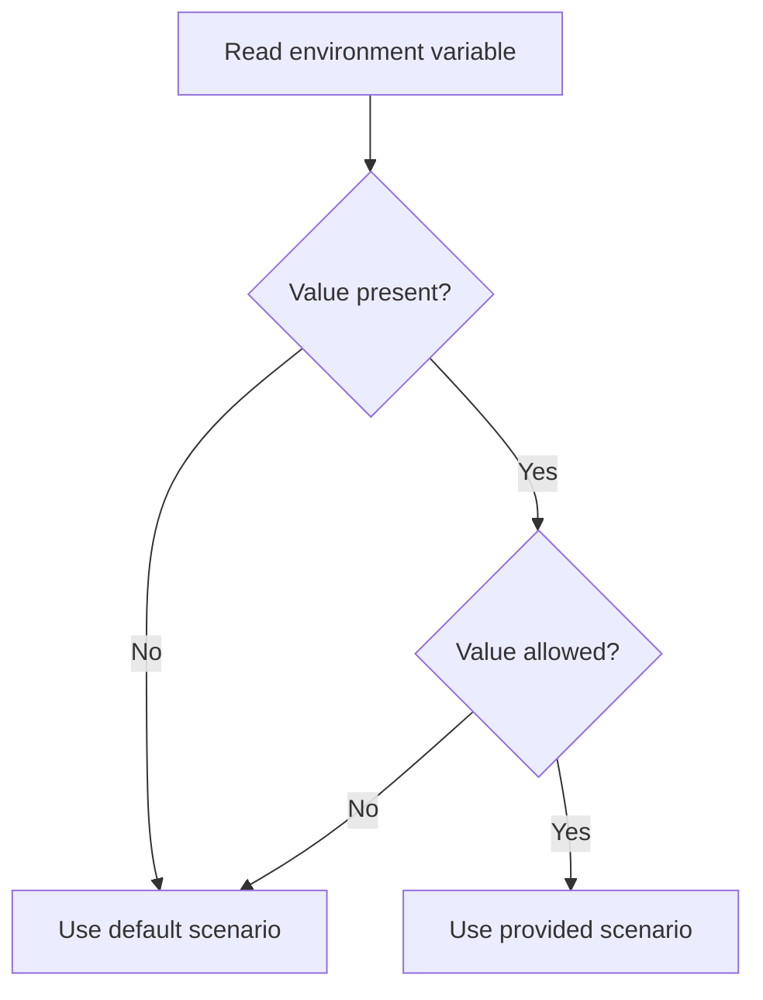
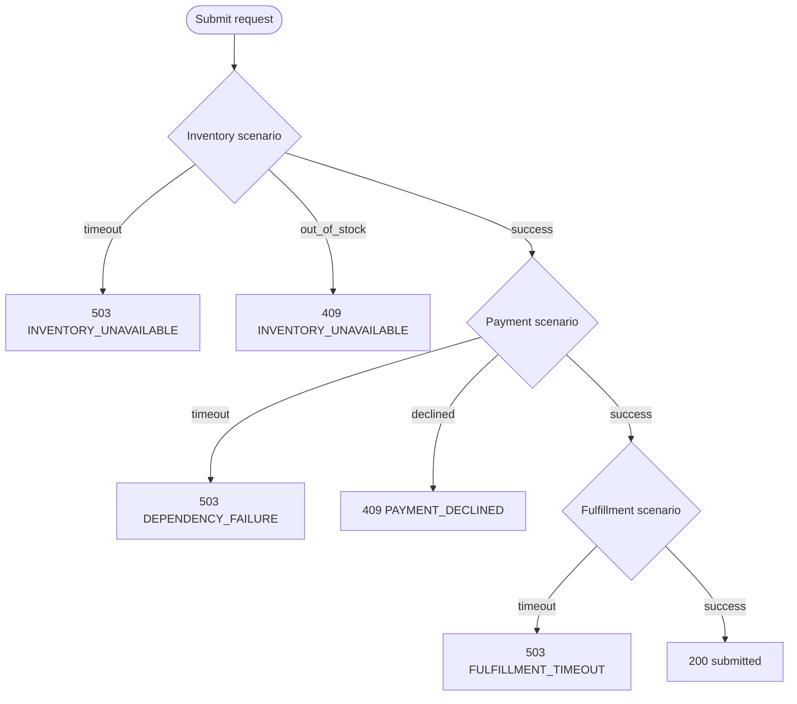
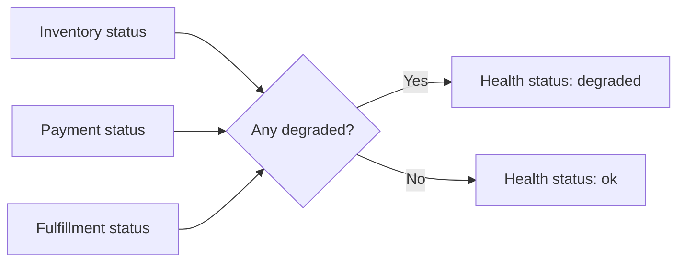
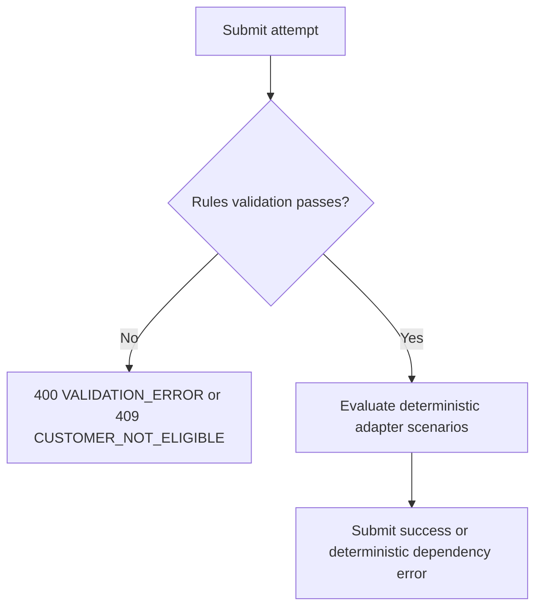

# Mock Scenario Configuration

Mock behavior is controlled by environment variables and is deterministic.

## Scenario Resolution Diagram

## Core toggles

- MOCK_MODE=true
- MOCK_INVENTORY_SCENARIO=success|out_of_stock|timeout
- MOCK_PAYMENT_SCENARIO=success|declined|timeout
- MOCK_FULFILLMENT_SCENARIO=success|timeout

## Optional delay controls

- MOCK_INVENTORY_DELAY_MS=0
- MOCK_PAYMENT_DELAY_MS=0
- MOCK_FULFILLMENT_DELAY_MS=0

## Expected behavior by scenario

### Inventory

- success: reserveItems returns reserved true with deterministic reservationId
- out_of_stock: reserveItems returns reserved false
- timeout: reserveItems throws INVENTORY_UNAVAILABLE with 503

### Payment

- success: authorize returns authorized true with deterministic transactionId
- declined: authorize returns authorized false
- timeout: authorize throws DEPENDENCY_FAILURE with 503

### Fulfillment

- success: createShipment returns accepted true with deterministic shipmentId
- timeout: createShipment throws FULFILLMENT_TIMEOUT with 503

## Submit Scenario Decision Diagram

## Health endpoint mapping

GET /health reports:

- ok when all scenarios are success
- degraded when any scenario is non-success

## Rules and Scenario Interplay

Rules-based field and eligibility validation is planned to run before submit orchestration.

## Testing recommendations

- Keep all delays at 0 for fast and stable CI.
- Set one degraded scenario at a time for clear assertions.
