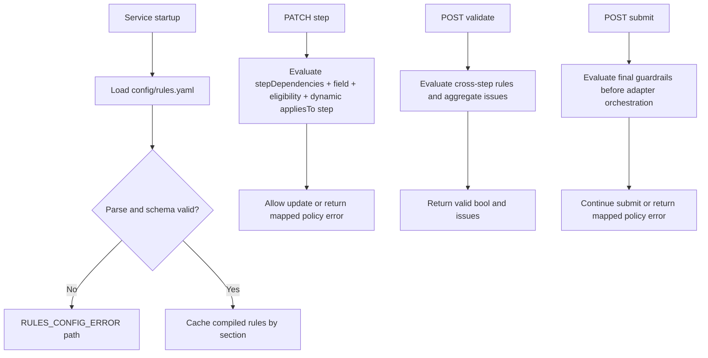
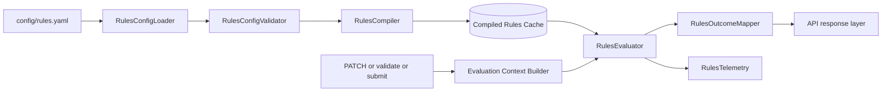
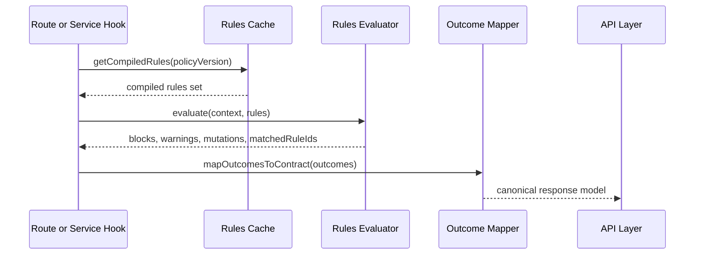
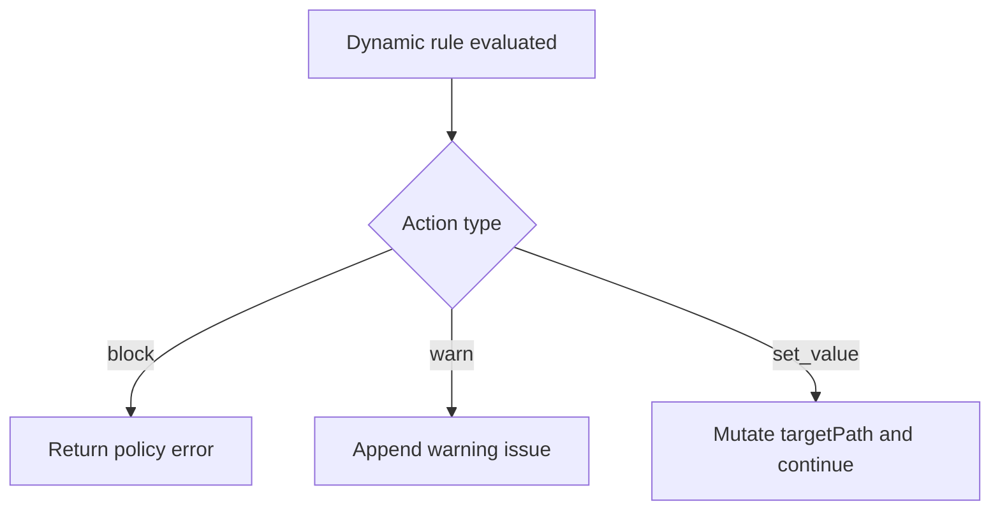

# Rules Integration and Dynamic Expansion

This document explains how config/rules.yaml is intended to be integrated into checkout processing, how rule outcomes should map to API behavior, and how to expand rules safely over time.

## Scope

- Source policy file: ../config/rules.yaml
- Target integration points:
  - PATCH /v1/checkout/journeys/{journeyId}/steps/{stepId}
  - POST /v1/checkout/journeys/{journeyId}/validate
  - POST /v1/checkout/journeys/{journeyId}/submit

This guide reflects the current Phase 11 POC implementation and calls out the remaining gaps separately.

## Current status vs planned status

Current state:

- Rules service loads rules.yaml during service construction.
- PATCH, validate, and submit evaluate field rules, eligibility rules, step dependencies, and dynamic rules in deterministic order.
- API error mapping includes rule-aware detail fields through the error details array.

Remaining gaps:

- Rules configuration uses a lightweight runtime validator rather than a full schema validator.
- Only the focused POC operator subset is executable: eq, in, regex, exists, gte.
- set_value is intentionally constrained to a single controlled target path.

## rules.yaml structure

rules.yaml currently organizes policy into these sections:

- policyVersion and defaults
- runtime and featureFlags
- ruleEvaluation controls
- fieldRules
- eligibilityRules
- stepDependencies
- dynamicRules

### Functional meaning of major sections

- fieldRules
  - Required fields and format checks by step.
  - Typical outcome: VALIDATION_ERROR.
- eligibilityRules
  - Policy constraints for customer or state combinations.
  - Typical outcome: CUSTOMER_NOT_ELIGIBLE.
- stepDependencies
  - Required completion ordering between checkout steps.
  - Typical outcome: STEP_CONFLICT.
- dynamicRules
  - Config-driven conditional logic with priority and actions.
  - Actions: block, warn, set_value.

## Runtime integration design

## Rules architecture

This section describes the internal architecture of the rules subsystem as a standalone concern.

### Core components

- RulesConfigLoader
  - Reads rules.yaml from config path.
  - Produces raw config object and metadata (load time, version).
- RulesConfigValidator
  - Validates schema shape and required fields.
  - Enforces allowed operator/action values.
- RulesCompiler
  - Normalizes rules into executable structures.
  - Pre-sorts by priority and resolves appliesTo scopes.
- RulesEvaluator
  - Executes rules against request/journey context.
  - Produces matched blocks, warnings, and mutations.
- RulesOutcomeMapper
  - Maps evaluator outcomes to API response contracts.
  - Ensures canonical code/message/details structures.
- RulesTelemetry
  - Emits matched ruleIds, policyVersion, and evaluation timing.

### Component diagram

### Runtime sequence

### Interfaces and data contracts

Recommended internal interfaces:

- evaluate(context, compiledRules) -> RuleEvaluationResult
- mapEvaluation(result) -> mapped errors or warnings
- getCompiledRules(version?) -> compiled immutable rules bundle

Recommended RuleEvaluationResult fields:

- blocked: boolean
- warnings: array
- mutations: array
- matchedRuleIds: array
- evaluationMs: number
- policyVersion: string

### Caching and version strategy

- Cache compiled rules in memory at startup for low-latency evaluation.
- Keep policyVersion in the cache key and response telemetry.
- On config reload or deployment, atomically swap cache reference.
- Reject partial or invalid reloads and keep last known good compiled rules.

### Failure modes and fallback behavior

- Config parse failure
  - Startup path: fail fast or start in degraded mode by policy.
  - Reload path: keep last known good compiled rules.
- Unknown operator or malformed action
  - Follow unknownOperatorBehavior (recommended fail).
- Mapper failure
  - Return INTERNAL_ERROR while preserving requestId and correlationId.
- Telemetry failure
  - Do not block request flow; degrade logging only.

### Backward compatibility and rollout

- Add new operator/action support as additive changes.
- Keep old rule fields supported until policy migration is complete.
- Version rule schema explicitly and document migration steps.
- Gate new rule families behind feature flags where possible.

## Evaluation order and conflict resolution

Recommended deterministic order:

1. Step dependency checks
2. Field validation checks
3. Eligibility checks
4. Dynamic rules (sorted by priority desc then ruleId)

Behavior controls from rules.yaml:

- stopOnFirstBlock
  - true: first blocking rule short-circuits evaluation.
  - false: accumulate blocks and warnings.
- defaultSeverity
  - applied where rule severity is missing.
- unknownOperatorBehavior
  - fail: treat unknown operators as configuration/runtime errors.

## Error mapping conventions

Map rule outcomes to canonical API errors:

- Missing/format validation -> VALIDATION_ERROR (400)
- Eligibility policy violation -> CUSTOMER_NOT_ELIGIBLE (409)
- Step dependency violation -> STEP_CONFLICT (409)
- Rules file parse/load/runtime issue -> RULES_CONFIG_ERROR (500 or 503 based on policy)

Recommended error details shape:

- ruleId
- fieldPath
- reason
- severity

## Dynamic rules action semantics

### block

- Stops request progression for the current flow.
- Returns mapped error code and message.

### warn

- Does not block progression.
- Appends warnings to validation output when supported.

### set_value

- Mutates target context path in a controlled way.
- Must be auditable and deterministic.

## Endpoint-by-endpoint expectations

### PATCH step update

- Evaluate rules relevant to current step and prerequisites.
- Reject on block outcomes with deterministic error code.
- Include ruleId and fieldPath details where available.

### POST validate

- Evaluate full-journey readiness and applicable rule families.
- Return valid plus aggregated issues and warnings.

### POST submit

- Re-check final policy guardrails before adapters.
- Reject policy errors before dependency orchestration.

## Safe dynamic expansion process

1. Add or update rule entry in rules.yaml.
2. Assign explicit ruleId, priority, and clear appliesTo scope.
3. Add effective windows only when needed.
4. Add deterministic test coverage:
  - unit tests for rule evaluation behavior
  - integration test for endpoint-visible outcome
  - postman scenario update when user-facing behavior changes
5. Update docs:
  - customer-journey-requirements.md if business behavior changed
  - postman-guide.md if new scenario should be demonstrated

## Example expansion patterns

### Add a new eligibility block

- Add eligibilityRules entry with ruleId, conditions, and outcome.
- Add integration test asserting 409 and code CUSTOMER_NOT_ELIGIBLE.

### Add a non-blocking warning rule

- Add dynamicRules entry with action type warn.
- Ensure validate response supports warnings list.

### Add a pricing mutation rule

- Add dynamicRules entry with action type set_value and targetPath.
- Add tests asserting deterministic mutated output.

## Testing matrix for rules integration

Minimum coverage per new rule:

- Positive case: rule condition met and expected action occurs.
- Negative case: condition not met and flow unchanged.
- Priority case: interaction with higher/lower priority rules.
- Error mapping case: endpoint returns correct code and details.

## Observability and support diagnostics

For policy incidents:

- Capture requestId and correlationId from API response.
- Log matched ruleIds and action results when rules engine runs.
- Record policyVersion used during request evaluation.

## Known gaps

- Runtime rules service implementation is pending.
- Route/service currently enforce a subset of dependency and validation behavior directly.
- Full warning/set_value output contract should be finalized before broad rollout.
