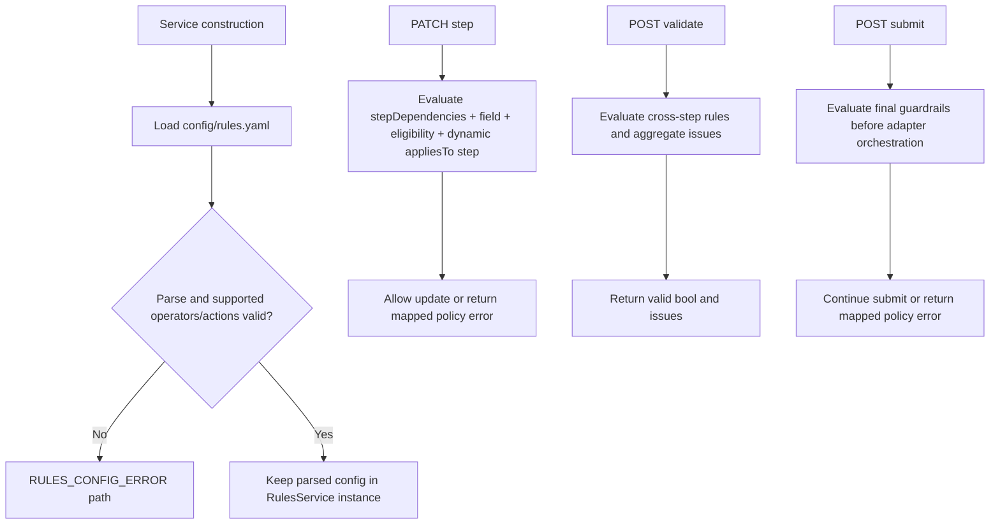
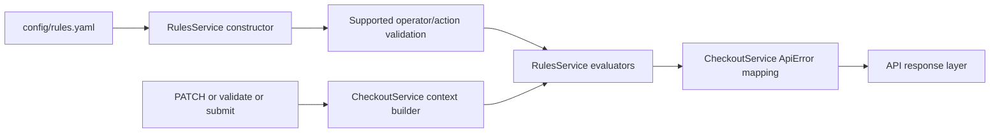
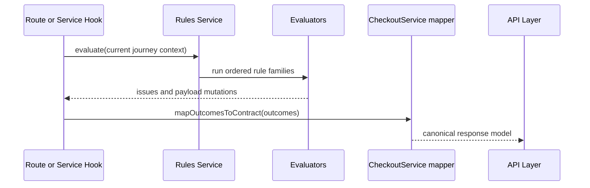
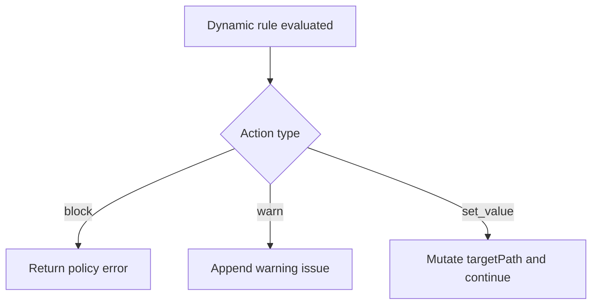

# Rules Integration and Dynamic Expansion

This document explains how config/rules.yaml is currently integrated into checkout processing in the Phase 11 POC, how rule outcomes map to API behavior, and how to expand rules safely over time.

## Scope

- Source policy file: ../config/rules.yaml
- Target integration points:
  - PATCH /v1/checkout/journeys/{journeyId}/steps/{stepId}
  - POST /v1/checkout/journeys/{journeyId}/validate
  - POST /v1/checkout/journeys/{journeyId}/submit

This guide reflects the current Phase 11 POC implementation and calls out the remaining gaps separately.

## Current status vs planned status

Current state:

- Rules service loads rules.yaml during service construction.
- PATCH, validate, and submit evaluate field rules, eligibility rules, step dependencies, and dynamic rules in deterministic order.
- API error mapping includes rule-aware detail fields through the error details array.

Remaining gaps:

- Rules configuration uses a lightweight runtime validator rather than a full schema validator.
- Only the focused POC operator subset is executable: eq, in, regex, exists, gte.
- set_value is intentionally constrained to a single controlled target path.

## rules.yaml structure

rules.yaml currently organizes policy into these sections:

- policyVersion and defaults
- runtime and featureFlags
- ruleEvaluation controls
- fieldRules
- eligibilityRules
- stepDependencies
- dynamicRules

### Functional meaning of major sections

- fieldRules
  - Required fields and format checks by step.
  - Typical outcome: VALIDATION_ERROR.
- eligibilityRules
  - Policy constraints for customer or state combinations.
  - Typical outcome: CUSTOMER_NOT_ELIGIBLE.
- stepDependencies
  - Required completion ordering between checkout steps.
  - Typical outcome: STEP_CONFLICT.
- dynamicRules
  - Config-driven conditional logic with priority and actions.
  - Actions: block, warn, set_value.

## Runtime integration design

## Rules architecture

This section describes the current POC architecture and separates it from the broader target architecture.

### Current POC components

- RulesService
  - Loads and parses rules.yaml when the service is constructed.
  - Performs lightweight validation for supported operators and actions.
  - Evaluates step dependencies, field rules, eligibility rules, and dynamic rules.
  - Returns issues and any allowed payload mutation for the calling checkout service.
- CheckoutService integration
  - Invokes rules evaluation during PATCH, validate, and submit.
  - Maps blocking issues to ApiError with canonical HTTP status codes.
  - Preserves warning issues for validate responses and step-level validation state.

### Target architecture for a future expansion

- Dedicated loader, validator, compiler, cache, and telemetry components remain valid future directions.
- Those components are not split out yet in the current POC implementation.

### Component diagram

### Runtime sequence

### Interfaces and data contracts

Current POC interfaces:

- evaluateForStepUpdate(journey, stepId, payload) -> RulesEvaluationResult
- evaluateForValidate(journey) -> RulesEvaluationResult
- evaluateForSubmit(journey) -> RulesEvaluationResult

Current RulesEvaluationResult fields:

- nextPayload: object
- issues: array

### Caching and version strategy

- The current POC keeps the parsed config on the RulesService instance created by CheckoutService.
- There is no hot reload, versioned cache, or last-known-good swap behavior yet.
- If startup parsing or validation fails, the service returns RULES_CONFIG_ERROR during evaluation.

### Failure modes and fallback behavior

- Config parse failure
  - Current behavior: keep an internal config error and return RULES_CONFIG_ERROR on rule evaluation.
- Unknown operator or malformed action
  - Current behavior: fail validation during service construction and surface RULES_CONFIG_ERROR at runtime.
- Mapper failure
  - Current behavior: CheckoutService maps rule issues to ApiError before route error handling.
- Telemetry failure
  - Not applicable yet because rules-specific telemetry is not implemented.

### Backward compatibility and rollout

- Add new operator/action support as additive changes.
- Keep old rule fields supported until policy migration is complete.
- Version rule schema explicitly and document migration steps.
- Gate new rule families behind feature flags where possible.

## Evaluation order and conflict resolution

Recommended deterministic order:

1. Step dependency checks
2. Field validation checks
3. Eligibility checks
4. Dynamic rules (sorted by priority desc then ruleId)

Behavior controls from rules.yaml:

- stopOnFirstBlock
  - true: first blocking rule short-circuits evaluation.
  - false: supported by config shape, but the current POC behavior is only exercised with the default true setting.
- defaultSeverity
  - present in config but not actively used by the current POC.
- unknownOperatorBehavior
  - fail: treated as a rules configuration error during service construction.

## Error mapping conventions

Map rule outcomes to canonical API errors:

- Missing/format validation -> VALIDATION_ERROR (400)
- Eligibility policy violation -> CUSTOMER_NOT_ELIGIBLE (409)
- Step dependency violation -> STEP_CONFLICT (409)
- Rules file parse/load/runtime issue -> RULES_CONFIG_ERROR (503)

Current error details shape:

- field
- reason

Note:
- field is populated from the validation issue fieldPath when present.
- reason includes the ruleId prefix when a ruleId exists.
- severity is preserved in validate response issues, not in the error details array.

## Dynamic rules action semantics

### block

- Stops request progression for the current flow.
- Returns mapped error code and message.

### warn

- Does not block progression.
- Appends warnings to validation output when supported.

### set_value

- Mutates target context path in a controlled way.
- Must be auditable and deterministic.

## Endpoint-by-endpoint expectations

### PATCH step update

- Evaluate rules relevant to current step and prerequisites.
- Reject on block outcomes with deterministic error code.
- Include ruleId and fieldPath details where available.

### POST validate

- Evaluate full-journey readiness and applicable rule families.
- Return valid plus aggregated issues and warnings.
- valid is true when all issues are warnings and false when any blocking issue is present.

### POST submit

- Re-check final policy guardrails before adapters.
- Reject policy errors before dependency orchestration.

## Safe dynamic expansion process

1. Add or update rule entry in rules.yaml.
2. Assign explicit ruleId, priority, and clear appliesTo scope.
3. Add effective windows only when needed.
4. Add deterministic test coverage:
  - unit tests for rule evaluation behavior
  - integration test for endpoint-visible outcome
  - postman scenario update when user-facing behavior changes
5. Update docs:
  - customer-journey-requirements.md if business behavior changed
  - postman-guide.md if new scenario should be demonstrated

## Example expansion patterns

### Add a new eligibility block

- Add eligibilityRules entry with ruleId, conditions, and outcome.
- Add integration test asserting 409 and code CUSTOMER_NOT_ELIGIBLE.

### Add a non-blocking warning rule

- Add dynamicRules entry with action type warn.
- Ensure validate response supports warnings list.

### Add a pricing mutation rule

- Add dynamicRules entry with action type set_value and targetPath.
- Add tests asserting deterministic mutated output.

## Testing matrix for rules integration

Minimum coverage per new rule:

- Positive case: rule condition met and expected action occurs.
- Negative case: condition not met and flow unchanged.
- Priority case: interaction with higher/lower priority rules.
- Error mapping case: endpoint returns correct code and details.

## Observability and support diagnostics

For policy incidents:

- Capture requestId and correlationId from API response.
- Log matched ruleIds and action results when rules engine runs.
- Record policyVersion used during request evaluation.

## Known gaps

- Loader/compiler/cache/telemetry separation is still future work.
- policyVersion is read from config shape but not surfaced in responses or logs.
- set_value support is intentionally limited to one controlled target path.
- Full warning/set_value response contracts should be finalized before broad rollout.
